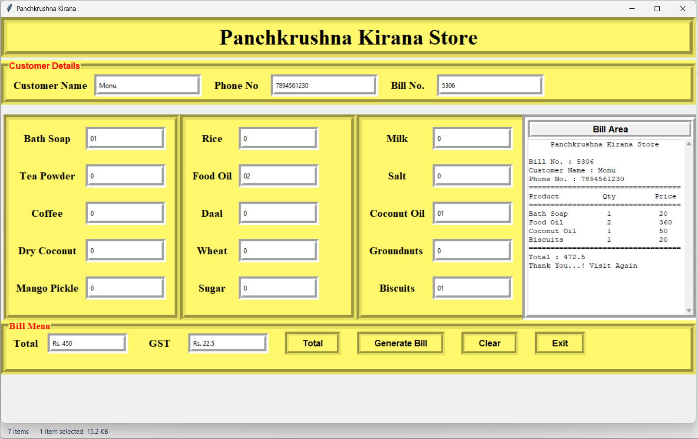
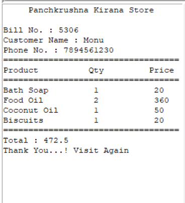

# 🛒 GUI-Based Grocery Billing System

A desktop-based Grocery Billing System developed using **Python** and **Tkinter**. The application provides a simple graphical interface for generating grocery bills, calculating GST automatically, and displaying a formatted invoice for customers.

---

## 📌 Project Overview

The Grocery Billing System is designed to simplify the billing process for small grocery stores. Users can enter customer information, specify product quantities, automatically calculate the total amount with GST, and generate a detailed bill through an intuitive graphical user interface.

This project demonstrates Python GUI programming using Tkinter along with basic billing and inventory concepts.

---

## ✨ Features

- 🧾 Customer Information Management
- 🛍️ Multiple Grocery Product Billing
- ➕ Automatic Price Calculation
- 💰 GST Calculation
- 📄 Bill Generation
- 🖥️ User-Friendly Tkinter GUI
- 🔄 Clear and Reset Functionality
- 🎲 Random Bill Number Generation

---

## 🛠️ Technologies Used

- Python 3
- Tkinter
- Random Module

---

## 📸 Application Preview

### Home Screen

<p align="center">
  
</p>

---

### Generated Bill

<p align="center">
  
</p>

---

## 📂 Project Structure

```
Python-Grocery-Billing-System
│
├── Source_Code
│   └── GroceryBilling.py
│
├── Images
│   ├── HomeScreen.png
│   ├── BillGenerated.png
│   └── Demo.gif
│
├── Documentation
│   └── PWP_MicroProject_Report.pdf
│
├── README.md
├── LICENSE
└── requirements.txt
```

---

## ⚙️ How to Run

### Clone the Repository

```bash
git clone https://github.com/yourusername/Python-Grocery-Billing-System.git
```

### Navigate to the Project Folder

```bash
cd Python-Grocery-Billing-System
```

### Run the Application

```bash
python GroceryBilling.py
```

---

## 🛍️ Available Products

- Bath Soap
- Tea Powder
- Coffee
- Dry Coconut
- Mango Pickle
- Rice
- Food Oil
- Daal
- Wheat
- Sugar
- Milk
- Salt
- Coconut Oil
- Groundnuts
- Biscuits

---

## 🚀 Future Improvements

- Database Integration (SQLite/MySQL)
- Product Inventory Management
- Login Authentication
- Bill Saving as PDF
- Receipt Printing Support
- Barcode Scanner Integration
- Search Previous Bills
- Product CRUD Operations

---

## 🎯 Learning Outcomes

- Python Programming
- GUI Development using Tkinter
- Event-Driven Programming
- Billing System Logic
- GST Calculation
- Python Functions and Variables

---

## 👨‍💻 Author

**Mohan Ugale**

Diploma in Computer Technology

K. K. Wagh Polytechnic, Nashik, Maharashtra

---

## ⭐ Support

If you found this project helpful, please consider giving it a ⭐ on GitHub.
